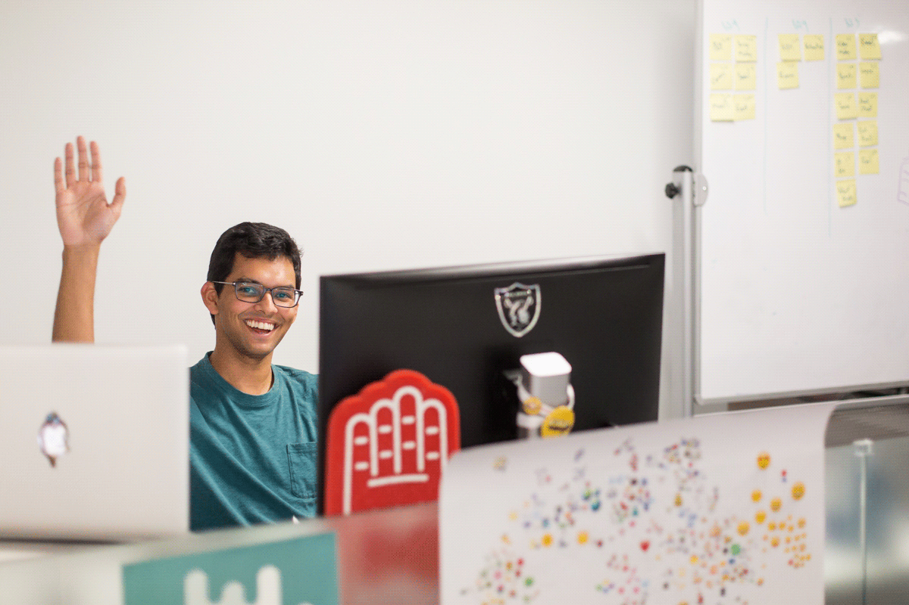

Hi! My name is Neel Shivdasani, and I live in Atlanta, Ga.

I'm a product manager at Mailchimp, where I build data science features that empower small businesses. Prior becoming a product manager, I spent several years as a data scientist. You can learn more about these sorts of things [on linkedin](http://linkedin.dataneel.com).

I also like to make generative visual art, and you can find it [on instagram](http://instagram.com/neel_generates). This hobby led me to cofound an onlie art gallery where buyers could customize and order unique art prints. It's called [GASP Gallery](http://ww.gasp.gallery), but it's currently on hiatus.

You can reach out to me on [twitter](http://twitter.dataneel.com), [linkedin](http://linkedin.dataneel.com), and [instagram](http://instagram.com/neel_generates). Thanks!
