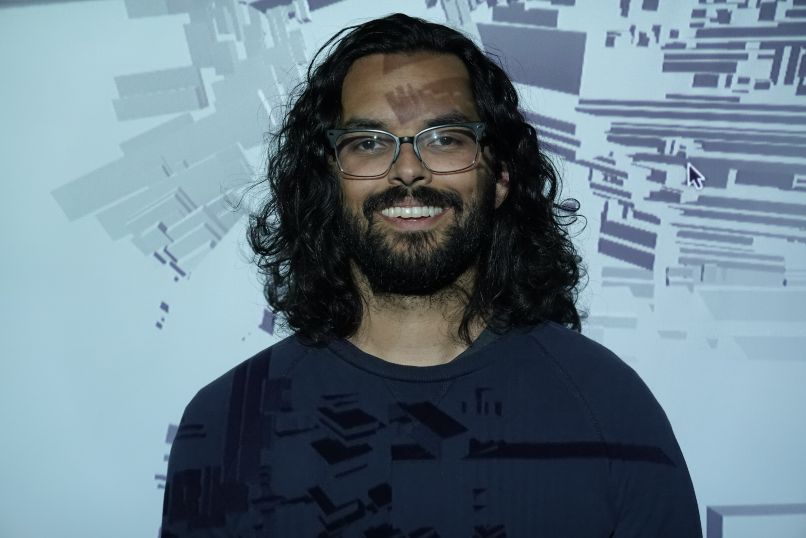

<head>
  

    </head>

Hi! My name's **Neel Shivdsasani**, and I live in Atlanta, Ga.

I'm a product manager by day, generative artist by night, and data scientist at heart.

* View my art on [Instagram](https://instagram.com/neel.shivdasani)
* Explore my art blocks project, Tropism, on [Art Blocks](https://www.artblocks.io/project/224) and [OpenSea](https://opensea.io/collection/tropism-by-neel-shivdasani)
* Buy my art on [Foundation](https://foundation.app/0xB981c2ca4682EB4Aa5b1856de35B6dF385a54DA6)
* Read my [fire tweets](https://twitter.com/dataneel)
* Learn about my work [on LinkedIn](https://www.linkedin.com/in/neelshivdasani/)

