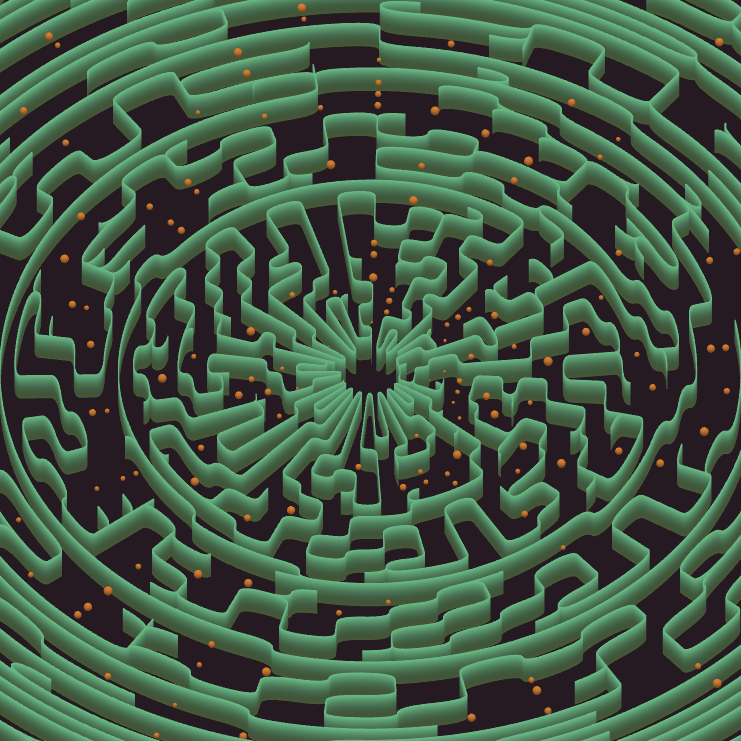
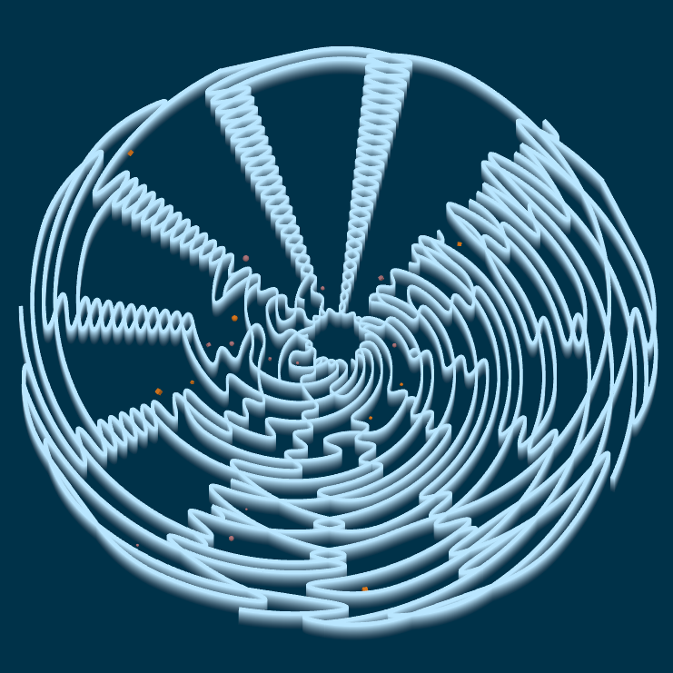
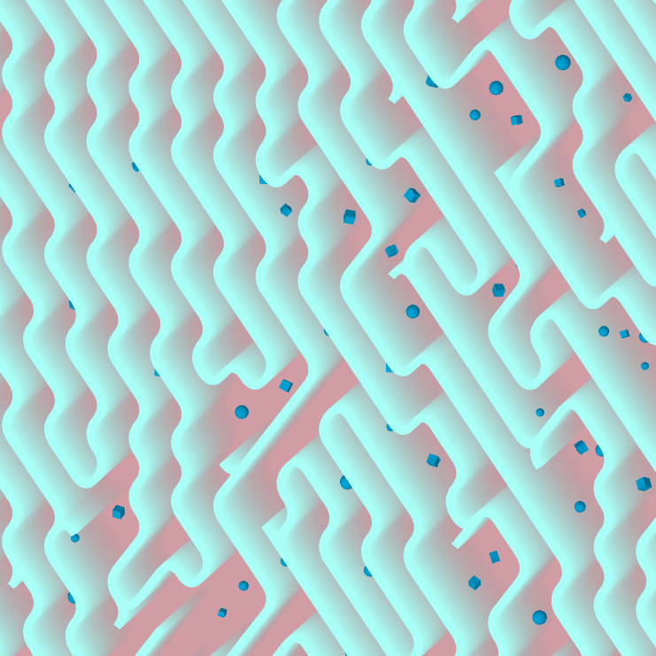
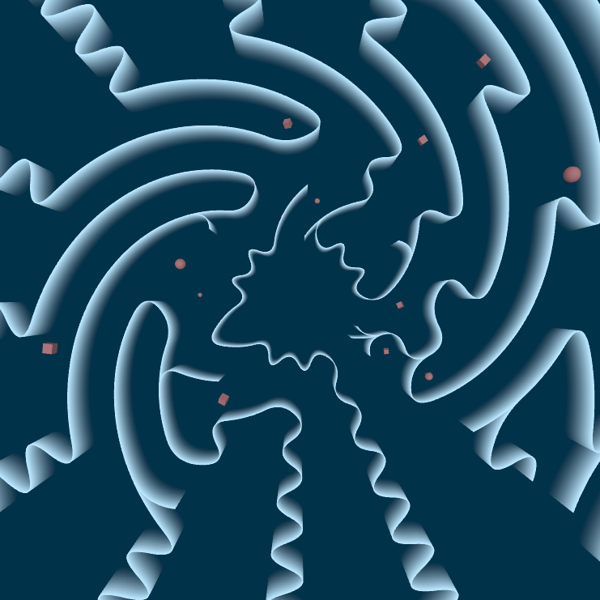
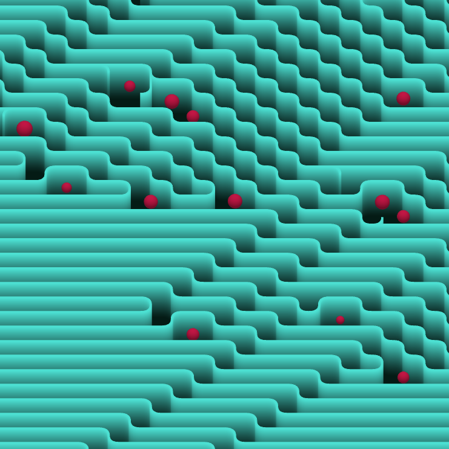
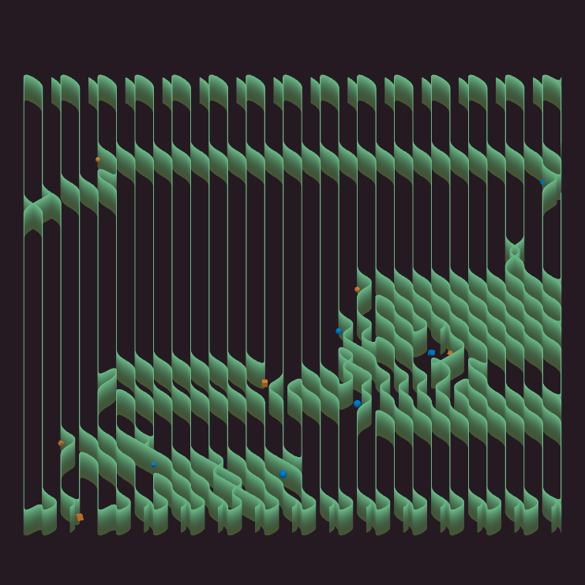

# Tropism: art that unintentionally depicts process

*Ropsten test mint 104. More test mints at the bottom*

On December 16th, 2021, I will release my first work of my first on-chain work of generative art, [Tropism](https://www.artblocks.io/project/224), via Art Blocks. Its description reads...

`Tropism is the phenomenon in which an organism's growth is influenced by environmental stimuli. Organisms of all shapes, sizes, and colors encounter varying amounts of external forces as they grow. These environmental stimuli are internalized, and the marks they leave end up being the defining characteristics of a life.`

That's the real definition of tropism. In my world, Tropism is an emergent system that has resulted from years of tinkering, bugs, successes, life events, community influence, and artistic evolution. In that regard, the process of creating this work of generative art has been very similar to what the art itself depicts.

## The origins of my art and Tropism
I had always been interested in art, but I never felt I had the skills to make it. I was a computer person. A math person. I just wasn't an artist. I started to doubt that assesment in the mid-2010s, when I first found out about generative art from artists like [Anders Hoff (Inconvergent)](https://inconvergent.net/) and [Jessica Rosenkrantz (Nervous System)](https://n-e-r-v-o-u-s.com/about_us.php).

I spent years observing instead of trying to make my own. Then, something changed. I stopped writing code for work. After accepting that reality for a while, I eventually decided I could fill that void by writing code for fun. The first result was this unremarkable image from February 6th, 2019.

  <iframe
    src="https://www.instagram.com/p/BtkJnV5nKAH/embed"
    frameborder="0"
    allowfullscreen
    scrolling="no"
    allowtransparency
    width="600"
    height="660"
  ></iframe>

This was day 1 of a self-imposed 30 day creative coding challenge. I'm pretty sure it was a tutorial from processing.org.

For nearly a month, I wore my 'influences' on my sleeve and copied other artists. It's a natural thing to do, and it shaped my path forward. Then, 25 days in, I decided to take more cues from my immediate environment. The first was a vine growing up the side of a building on 8th street in Atlanta, Georgia. I attacked it with the tool that seemed best... depth-first graph search. It was something I learned on the job years before.

  <iframe
    src="https://www.instagram.com/p/BujWPFAH2Ev/embed"
    frameborder="0"
    allowfullscreen
    scrolling="no"
    allowtransparency
    width="600"
    height="660"
  ></iframe>

This was actually a bug, and not at all the intended outcome. That's fine. It happens. I learned from it and tried again.

  <iframe
    src="https://www.instagram.com/p/BuoH3VKnuHZ/embed"
    frameborder="0"
    allowfullscreen
    scrolling="no"
    allowtransparency
    width="600"
    height="660"
  ></iframe>

This was, more or less, what I set out to do. I loved it at the time, and I decided to see where else it would go.

  <iframe
    src="https://www.instagram.com/p/Bu6H_07H5ZR/embed"
    frameborder="0"
    allowfullscreen
    scrolling="no"
    allowtransparency
    width="600"
    height="660"
  ></iframe>

Realistically, this code wasn't that different from my first attempt. Nevertheless, very small differences in this system can manifest in drastically different outcomes.

It's around this time that myself and two of my colleagues started [GASP Gallery](https://www.instagram.com/gasp.gallery/), a website where buyers could customize and buy art from myself, [Kjetil Golid](https://www.instagram.com/p/B1ynnJMnD4b/), [Aaron Penne](https://www.instagram.com/p/B1gfFVcnKJJ/), and [Devi Parikh.](https://www.instagram.com/p/B4Cpqx6nLAn/).  In many ways, this was my first attempt at what people now call "long form" generative art. Long story short, the site crashed, but the work and relationships had a lasting impact on my work.

Back on the topic of graph search. I'd been creating these random graph structures, and it was alright. Then, on accident, I made them a bit less random. What resulted was a striking lesson that randomness is often more interesting when it emerges from and is surrounded by order. The structures feel more real, intentional, and also organic. It's a fascinating emergent behavior.

  <iframe
    src="https://www.instagram.com/p/Bwe2bKPn7T7/embed"
    frameborder="0"
    allowfullscreen
    scrolling="no"
    allowtransparency
    width="600"
    height="660"
  ></iframe>

And it works in many shapes.

  <iframe
    src="https://www.instagram.com/p/ByK2PRjnBsh/embed"
    frameborder="0"
    allowfullscreen
    scrolling="no"
    allowtransparency
    width="600"
    height="660"
  ></iframe>

And layouts.

  <iframe
    src="https://www.instagram.com/p/B1RixgGHJUJ/embed"
    frameborder="0"
    allowfullscreen
    scrolling="no"
    allowtransparency
    width="600"
    height="660"
  ></iframe>

And textures.

  <iframe
    src="https://www.instagram.com/p/B2MJADFnVqz/embed"
    frameborder="0"
    allowfullscreen
    scrolling="no"
    allowtransparency
    width="600"
    height="660"
  ></iframe>

And before I knew it, graph search seemed to be the algorithm that I used most often. I might see some cool animated art and go try it out, but then I'd come back to graph search.

  <iframe
    src="https://www.instagram.com/p/CGzlHKwHOeO/embed"
    frameborder="0"
    allowfullscreen
    scrolling="no"
    allowtransparency
    width="600"
    height="660"
  ></iframe>

Then I'd find something that would inspire me to try interactivity, and I'd incorporate it into graph search..

  <iframe
    src="https://www.instagram.com/p/CM1bIbMnurg/embed"
    frameborder="0"
    allowfullscreen
    scrolling="no"
    allowtransparency
    width="600"
    height="660"
  ></iframe>

And then 3D.

  <iframe
    src="https://www.instagram.com/p/CNHvLDtHjiF/embed"
    frameborder="0"
    allowfullscreen
    scrolling="no"
    allowtransparency
    width="600"
    height="660"
  ></iframe>

And then glsl/shaders (also minted on [Foundation](https://foundation.app/@neelshivdasani/~/76825)).

  <iframe
    src="https://www.instagram.com/p/CS_30CTnJHT/embed"
    frameborder="0"
    allowfullscreen
    scrolling="no"
    allowtransparency
    width="600"
    height="660"
  ></iframe>

Throughout my evolution as a generative artist, random inspiration from bugs, life events, and other artists would get absorbed into my work and steer my development. My specific combination of random influences is, hopefully, what makes my art unique. This echos the concept behind Tropism. The art unintentionally resembles the multi-year process from which it was born.

Whatever comes next won't share the same concept as Tropism, but it will share the same tangled history of life, influences, bugs, and other inputs that get baked into all of my work.

To close things out, here are some Ropsten test mints of Tropism.

